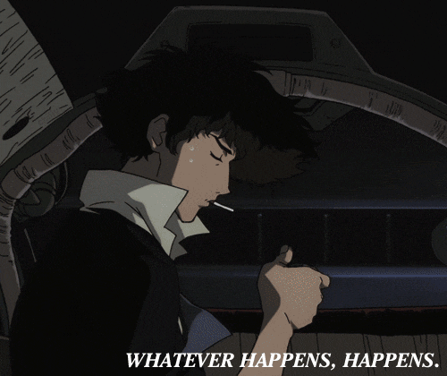

<picture>
  <source media="(prefers-color-scheme: dark)" srcset="./headers/welcome_white.png">
  
</picture>

<hr>




<!--START_SECTION:waka-->


**I Mostly Code in Go** 

```text
Go                       13 repos            █████████████░░░░░░░░░░░░   52.00 % 
Roff                     1 repo              █░░░░░░░░░░░░░░░░░░░░░░░░   04.00 % 
HTML                     1 repo              █░░░░░░░░░░░░░░░░░░░░░░░░   04.00 % 
JavaScript               1 repo              █░░░░░░░░░░░░░░░░░░░░░░░░   04.00 % 
Assembly                 1 repo              █░░░░░░░░░░░░░░░░░░░░░░░░   04.00 % 
```


<!--END_SECTION:waka-->
